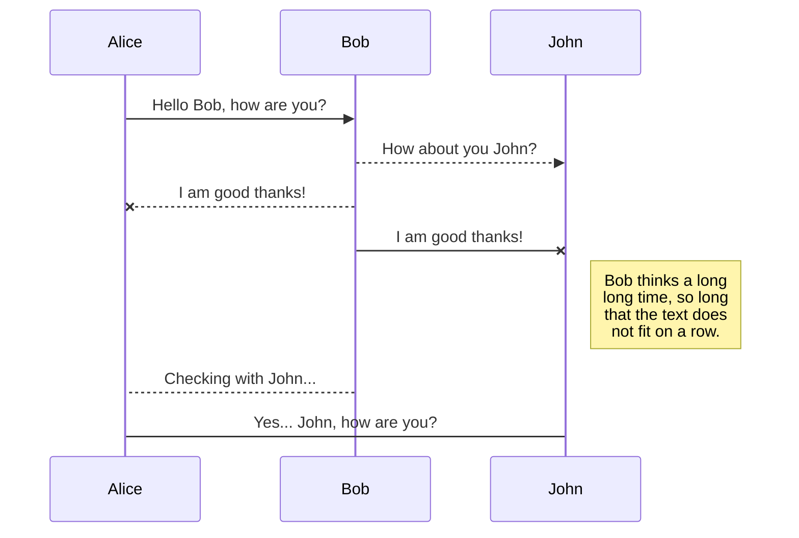
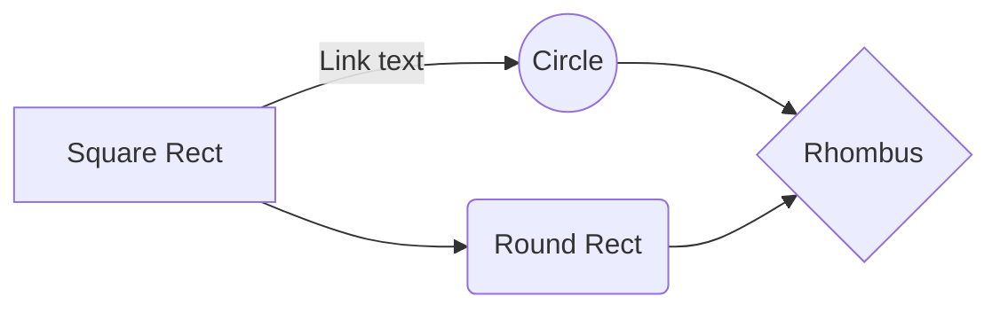

# Title 1

Lorem ipsum dolor sit amet, consectetur adipiscing elit. Curabitur ante est,
facilisis vitae ultricies sed, malesuada fringilla erat. Nullam imperdiet
mollis porta. Sed hendrerit tempor nulla, nec accumsan ligula sagittis ut.

Proin rhoncus eleifend posuere. Proin cursus orci nisl, quis imperdiet metus
interdum eget. Praesent lacinia odio urna, in blandit elit viverra vitae.
Maecenas non mauris vel quam efficitur pulvinar. Vestibulum at lacus ipsum.
Praesent ornare molestie aliquam. Mauris fermentum nisl sed feugiat lobortis.
Morbi laoreet porttitor tellus eu venenatis. Donec gravida mi non ultrices
consequat.

# Title 2

Lorem ipsum dolor sit amet, consectetur **Bold Text** adipiscing elit.

Proin rhoncus eleifend posuere. Proin *Italic Text* cursus orci nisl, quis imperdiet metus
interdum eget. 

Mauris fermentum nisl `inline code or command` sed feugiat lobortis.

> **Note:** Vestibulum at lacus ipsum.



And this will produce a flow chart:



## Sub-Title 1


## Sub-Title 2

Lorem ipsum dolor sit amet, consectetur adipiscing elit. 

```
  # Console
  sudo apt-get update
``` 
  
```python
# Python
print('Hello, world!')
```

```cpp
// C++
#include <iostream>
using namespace std;

int main() {
    // prints the string enclosed in double quotes
    cout << "This is C++ Programming";
    return 0;
}
```


